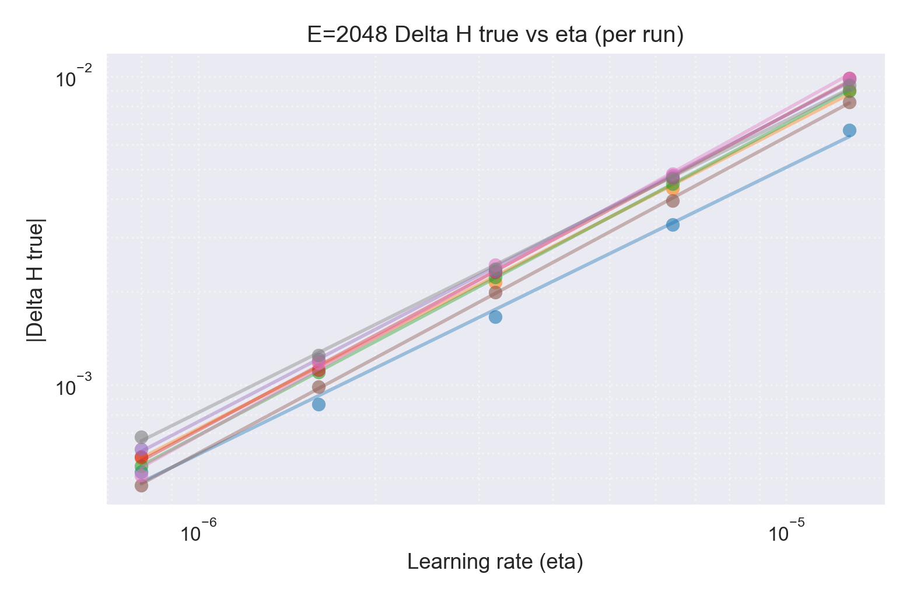
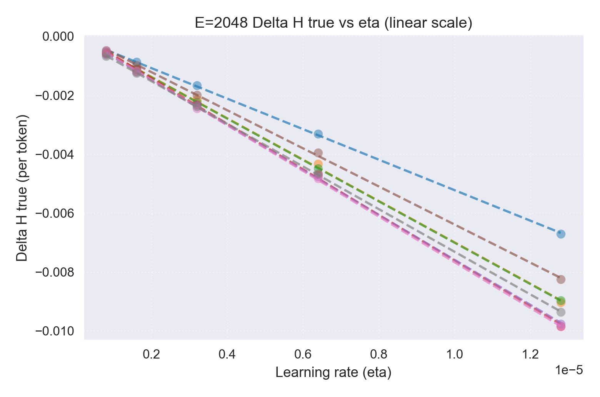
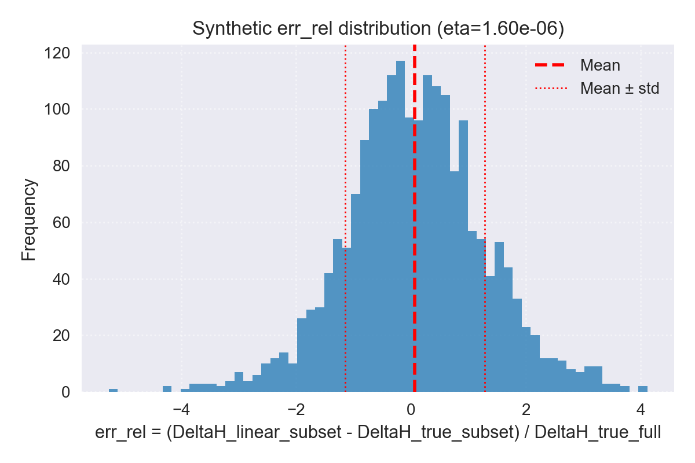

# Entropy Dynamics in Reinforcement Learning

A research project exploring entropy dynamics during reinforcement learning training, with a focus on understanding the theoretical foundations and empirical behavior of entropy changes in policy optimization. A big motivation is to understand what kind of sequences/tokens used in updates have especially large effect on the change in entropy, and whether we can characterize sequences that have a big effect on the entropy but not as much on the expected reward - in other words, are there sequences or tokens for which we can adjust the loss so that the entropy decreases less but at small cost to the change in expected reward. Or put even more simply, how can we encourage more exploration at small local cost to performance? Doing this probably helps performance overall down the line.

## Project Overview

Sort of inspired by https://arxiv.org/abs/2505.22617. Their derivations are done under very unrealistic assumptions. A more proper analysis (as I attempt to do in the docs folder) is somewhat more involved, and points to a lot of interesting things to study. So while a "main goal" would be to see if a proper analysis suggests any further modifications to the algorithm changes suggested by Cui et al, I'm mostly trying to just get some experience with running experiments to study the things encountered in the high level theory stuff.

We can roughly split what I'm doing into:

- **1/3 Theoretical Investigation**: Understanding entropy dynamics during gradient steps in policy optimization (see [`docs/RL_studies.pdf`](docs/RL_studies.pdf))
- **1/3 Infrastructure & Tooling**: Setting up training and experimentation code in the distributed setting, as well as various analysis tools
- **1/3 Empirical Exploration**: Taking lots of detours to get more familiar with interesting and useful things I'm learning about along the way (grdient noise scale for getting a sense of what is a good batch size, experimenting with various variance reduction techniques like Rao-Blackwellization and control variates, basically anything that seems worthwhile for doing better science)

I've started keeping a log of what I've done and am doing in the project for my own benefit, but it explains some of the design choices (see [`docs/Project_Log.pdf`](docs/Project_Log.pdf))

**For anyone reading this: the main folders to look at to see what I'm doing are the docs folder, containing my notes, and the entropy_experiments folder, which contains the main experimentation code.** 

Here's a summary of the idea behind the project:

In Cui et al (https://arxiv.org/abs/2505.22617), they find that tokens with a large covariance between logprob and advantage have a large effect on the entropy. It's easy to see that these are tokens in incorrect responses that have low probability. They propose methods of reducing the effect of these tokens on updates, and find that the entropy stabilizes. That makes intuitive sense: the basic policy gradient algorithms penalize this "unsuccessful exploration" but we can decide not to penalize these instances at small local cost in performance gains.

In a more thorough analysis of the step change in entropy, it is easy to see that something close to their results comes out if we assume the Fisher Kernel ($$\nabla \log \pi(t) \cdot \nabla \log \pi(t')$$, where t, t' are sequences of tokens) is proportional to the identity. While this is certainly not true, the emprical results from Cui et all suggests that in some sense this is not a horrible approximation. But it would be good to understand the structure of the Fisher Kernel more generally as it seems like a really fundamental object, and possibly with a more thorough analysis we would see better ways to tweak algorithms along the lines of Cui et al. The fisher kernel, by the way, has a simple interpretation as a measure of the influence a sequence $t_i'$ used in a gradient update has on the model's log probability for another sequence $t$. That's true in ordinary supervised learning with a cross entropy loss, and for policy gradients

$$\delta \log \pi(t) = \eta \frac{1}{B}\sum_{i=1}^B K(t,t_i') A(t_i')$$

Here the advantage just tells us the strength and direction of the update to the logprob. (Using Adam instead of SGD slightly changes the above formula but the idea is basically the same.) Clearly the fisher kernel should NOT behave like it is diagonal - the fact that sequences used for updates have a big effect on the model's probability for totally different sequences is the whole point! 

Here is a sampling of some current thoughts, so that any reader can get an idea of the way I am trying to think about this:

1) - I have shown that the linear order in learning rate formula for the entropy change is valid in the regime of learning rates that I'm interested in. This means that the simple "fisher correlation" picture is correct, which makes this problem seem fairly tractable.

2) - Vaguely, can we characterize what kind of sequences have large fisher correlation with others?

3) - More precisely, can we come up with some diagnostic for sequences that would be used in an update that tell us whether or not they have an outsized change on the entropy, and if so how this correlates with their effect on the RL loss?

Cui et al seem to have come up with a simple diagnostic: tokens with very low probability in incorrect responses. Are there other diagnostics? Is it useful to use things beyond token level statistics of the responses (e.g. factor in estimated difficulties for the prompts, characterized by past pass rates, or other 'qualitative' features)?

4) - In the end I'd like to have some sort of test for this that isn't just "tweak the loss and run training for a long time". Measuring the correlation between the step change in entropy change and step change in expected reward due to a tweak, for various update batches and model states (taken from checkpoints along short training runs) seems like the right approach for a simple test. Unfortunately it seems harder to get at the idea of "encouraging more exploration earlier on will pay dividends later" seems harder to test without extended (expensive!) runs...

### Key Components

entropy_experiments - At least for now this is where have our offline experiments, where we load checkpoints and do some tests on them. Currently implemented is the a measurement of the predicted value of $\delta\mathcal{H}$ and the true value. As part of that we also measure an estimator of the variance of the estimator of $\delta\mathcal{H}$ so we can get a sense of what batch sizes we need to make a good comparison (this is forcing me to become familiar with more sophisticated stats stuff). Next we will add some measurments of the Fisher Kernel itself. See the README.md in this folder for a hopefully up-to-date explanation of the various components.

rl_training - Some training code so we can do online measurements during training, or save checkpoints and do offline measurements on them. Online experiments will be put in this folder, including measuring the gradient noise scale during training, and measuring the predicted entropy step change.

### Results So Far

So far I've focused on doing a 'precision test' of the linear order approximation to $\delta \mathcal{H}$. In the end, I'm somewhat lucky: the linear approximation is quite valid in the range of learning rates I used for training (therefore the interesting learning rates), but for not much larger learning rates the nonlinear terms become important, and for slightly smaller ones, numerical precision limits my ability to measure the entropy change.

Let's briefly review the experimental setup and then I'll show some plots.

The main goal of this 'precision measurement' is to show that the linear approximation is valid for the learning rates of interest. We approach this in two ways. For both, we begin by sampling a batch of prompts, and for each we use the model with parameters $\theta$ to compute $G=8$ responses per prompt. Call this batch of prompt–response pairs $U$, and the model is chosen to be some checkpoint a few dozen steps into RL training so that we hopefully have relatively stable optimizer states. We also focus just on the LoRA parameters, freezing the base ones.

We then directly compute the change in model parameters from doing an RL update with $U$, rather than doing an actual model update. To do this we need to read off the AdamW optimizer states, compute the gradient of the RL loss, and assemble it all into an "update vector" $v$, which is the change in parameters normalized by the learning rate. We do all this so that we can reuse the update vector throughout our computations. (We could have done this instead by doing a real model update, reading off the new parameters, then computing the difference. I tested my update_vector.py's output against this approach and found they agree. I stuck with the explicit approach in case I want to mess around with it.)

Then, for a given update vector $v$, we do two things:

1. Estimate the true change in entropy after a step $\theta \rightarrow \theta + \eta v$ for various learning rates $\eta$.
2. Estimate the linear order change in entropy $\delta \mathcal{H}_1 = \eta \nabla \mathcal{H} \cdot v$ for those same learning rates.

and compare the results. We also computed the quadratic order term, but I won't discuss it here.

To estimate both the true and linearized entropy changes, we use the same batch $E$ of 'entropy' or 'eval' sequences, where we draw $|E|$ prompts from our pool with replacement and then for each compute the model response at parameters $\theta$. We compute just the entropy of the response tokens.

#### True Entropy Change

To compute the true change in entropy $\Delta \mathcal{H} = \mathcal{H}(\theta + \eta v) - \mathcal{H}(\theta)$ we need to be careful about:

1. Using importance sampling in our estimate of $\mathcal{H}(\theta + \eta v)$ since the $E$ batch was drawn from the model with parameters $\theta$.
2. Using variance reduction techniques since the entropy seems tricky to estimate (fat tails from sequences with unlikely tokens).

To reduce variance we do three things:

1. **Compute the per-token entropy rather than per-sequence.**

   This means we need to be careful about the importance sampling for the expected number of tokens as well. We also accept a small bias to compute $\mathbb{E}[H]/\mathbb{E}[T]$ where $T$ is the number of tokens, so our estimator for $\mathcal{H}(\theta + \eta v)$ becomes

$$
\mathcal{H}_{\text{per tok}}(\theta+\eta v) \rightarrow \sum_{t_i\in E} \frac{w\left(\theta + \eta v; t_i\right)}{\sum_{t_j\in E} w\left(\theta+\eta v; t_j\right) T_j} H(t_i)
$$

   where $w\left(\theta+\eta v; t\right)$ are the IS weights for sequence $t$ and shift $\theta \rightarrow \theta+\eta v$.

2. **Use a Rao-Blackwell estimator of the entropy.**

   The prefix of a token $t_k$ is sufficient to compute the entropy of the $k$'th term in the sequence:

$$
H_k\left(t_{k} \mid \text{prompt}, p\right) = \mathbb{E}\left[H_k \mid t_{\lt k}, \text{prompt}, p\right] = - \sum_{t_k' \in V} \pi\left(t_k' \mid t_{\lt k}, p\right) \log \pi\left(t_k' \mid t_{\lt k}, p\right)
$$

   So the estimator

$$
H^{RB} = \mathbb{E}_{t \sim \pi}\left[\sum_k H_k\right]
$$

   is not only easy to compute, but seems to noticeably reduce the variance.

3. **Consider control variates** (In the end I didn't find any that made a big difference so I'll not discuss this.)

In practice, we use PyTorch's `functional_call` to compute the model outputs with overridden parameters $\theta+\eta v$. We could have just done an actual update, but `functional_call` is needed for PyTorch's `jvp` which we use later so it was simpler to just use it everywhere.

#### Linearized Entropy Change

Similarly, to compute the linearized $\delta \mathcal{H}$ we need to account for the per-token normalization and also use variance reduction techniques. The linearized $\delta \mathcal{H}$ is a sum of three terms:

$$
\delta \mathcal{H}_1/\eta \times (T_{tot}/|E|) = \mathbb{E}[\nabla_v H] + \mathbb{E}[H \nabla_v \log \pi] - \mathbb{E}[H]\mathbb{E}[T \nabla_v \log \pi]
$$

where the factor of $(T_{tot}/|E|)$ is to convert from the per-sequence normalization implicit in the expectation values to the per-token normalization we use, and $\nabla_v(\cdot) = v \cdot \nabla(\cdot)$. The second term is from the IS weights in the numerator, the third for the IS weights in the denominator.

Using our RB estimator for $H$ means in the first term we simply take the gradient of the RB entropy

$$
\mathbb{E}[\nabla_v H] \rightarrow \frac{1}{|E|} \sum_{t_i\in E} \sum_{k=1}^{|t_i|} \nabla_v H_k^{RB}
$$

For the second term we can use the same logic used in the REINFORCE policy gradient objective to get a lower variance. $H$ is like the total reward, which we can decompose into entropy per step. The variance reduced version of the second term then involves the 'Entropy-to-go' for the sequence $G_k = \sum_{k'\geq k} H_k^{RB}$. We can also subtract a baseline to get

$$
\mathbb{E}[H \nabla_v \log \pi] \rightarrow \frac{1}{|E|} \sum_{t_i\in E} \sum_{k=1}^{|t_i|} (G_k - b_k) \nabla_v \log \pi(t_k | t_{\lt k}, p)
$$

I experimented with various baselines. An obvious choice is $b_k = H_k$, but we can also augment this by computing an ema of the remaining part of the entropy-to-go.

For the last term we can subtract a baseline $T$.

#### Some Practical Notes

To get my results, in addition to learning about and using these various variance reduction technqiues for my estimators, I found that I needed to raise the numerical precision wherever possible. I needed to have the model run at fp32 (and have everything else done at least at fp32, with the softmaxs and stuff done at fp64) or else $\Delta \mathcal{H}$ would stay flat as I decreased $\eta$. It took me quite a while to see this was the issue (I thought my estimators were just bad) - only when I saw that the changes in individual logprobs after an update were very quantized did I realize what was happening.

Even after raising the precision I still get this flattening happening for learning rates in the small end of the learning rates I studied (possibly some small effect at $\eta$ = 8e-7, and at $\eta$ = 4e-7 the data is unusuable).

I made heavy use of Pytorch's `functional_call` and `jvp` in my code. `functional_call` seemed like a simple approach to recomputing $\Delta \mathcal{H}$ for various learning rates, and for all the derivatives in the approximate $\delta \mathcal{H}$ (both linear and quadratic) Pytorch's `jvp`, which requires using `functional_call`, was either useful or pretty much essential. For the quadratic term we need the Hessian of the entropy dotted with the update vector, which is exactly what `jvp` is for. But also for the linear term we naturally have the structure that `jvp` is made for - we want the directional derivative of a vector, but the vector is the logprob for different sequences, which we then dot into the vector of baseline-subtracted entropies-to-go.

#### Results

Even with all the variance-reduction tricks in the entropy experiments, the linearized $\delta \mathcal{H}$ remains noisy. The encouraging news is that it matches the true entropy change extremely well on average, and the true entropy change behaves linearly in the learning rates of interest.

##### Linear Fit

Below are eight runs with $|E|=2048$. On a log–log plot the curves are effectively straight lines with slope almost exactly one, confirming the linear-in- $\eta$ behaviour.

| Run   | Slope | R²   |
|-------|:-----:|:----:|
| run_01 | 0.930 | 0.996 |
| run_02 | 0.980 | 0.999 |
| run_03 | 1.010 | 1.000 |
| run_04 | 1.022 | 1.000 |
| run_05 | 0.993 | 1.000 |
| run_06 | 1.025 | 1.000 |
| run_07 | 1.058 | 0.998 |
| run_08 | 0.947 | 0.999 |

The linear-scale view shows that each run extrapolates cleanly through the origin while differing in slope based on the update vector from that run. 

Runs 1 and 8 show the largest disagreement, but this is due to the smallest learning rate datapoints - if we remove these datapoint we get agreement. We have reason to be suspicious of these datapoints: They're pushing up against the regime where numerical precision limits our ability to precisely measure $\Delta \mathcal{H}$. I think these two data points (which are the smallest two values of $\Delta\mathcal{H}$ in the plot) are plausibly inflated a bit by numerical precision error.

##### Linearized $\delta\mathcal{H}$ Error Distribution

For the agreement study we drew 2,000 'synthetic' batches of size 256 from the $|E|=2048$ runs, computed the linearized and true entropy changes for each subsample, and normalised by the full-batch $\Delta \mathcal{H}_{true}$. The histogram below illustrates how the approximation errors spread.

For $\eta = 1.6\times 10^{-6}$ the mean relative error is $0.068$ with a standard deviation of $1.215$ (variance $\approx 1.48$). The approximation is centred near zero—as desired—but the spread reflects the inherent stochasticity of small batches.

### Models & Datasets
- **Models**: Qwen2.5-1.5B (LoRA fine-tuned)
- **Dataset**: GSM8K mathematical reasoning with R1 template format
- **Training Results**: Pass@1 improvement from about 52% to 65@ over 64 steps, approximately linear growth in pass rate over this range of training with no signs of slowing down yet, but I stopped at 64 since that gave me enough checkpoints to do some experiments with (for now), and the training is getting expensive. Batch size was chosen based on measuring the gradient noise scale (not quite, but something close to it which was more convenient to measure), and learning rate chosen by starting at a value I saw used for a similar model and task, then increased by 2 when the gradient noise to signal ratio seemed low enough for it to be safe. It would be nice to do a more thorough search for optimal choices but I'm not made of money and it's not like I'm aiming to do an extended training run.
- **Environment**: Lambda Cloud GPU instances (e.g 2x H100 80GB)

